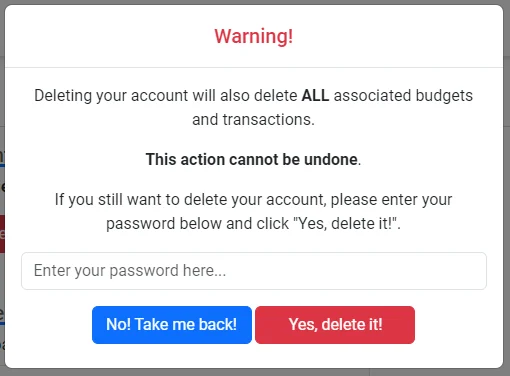

<h1 align="center" id="title"></h1>

A simple, yet powerful budgeting app. Create as many budgets as you like for the changing months, seasons and life events, and get insights into your spending.

Budgify was created as my third milestone project for the Code Institutes Level 5 Diploma in Web Application Development.

[View the live project here.](https://budgify-app-a7b562a0c28c.herokuapp.com/)


## User Experience (UX) 

### User stories

#### First Time Visitor Goals

-   As a first time visitor, I want to easily understand the purpose and features of the Budgify app without any prior knowledge.
-   As a first time visitor, I want to quickly create a new budget and explore the app's functionalities.
-   As a first time visitor, I don't want to be overwhelmed with complex instructions or processes to start using the app.
-   As a first time visitor, I want to be able to contact budgify easily with any issues or questions I have about the app.
-   As a first time visitor I want to be able to register easily and use the app straight away.

#### Returning Visitor Goals

-   As a returning visitor, I want to easily log in to my existing account and access my saved budgets.
-   As a returning visitor, I want to be able to modify or delete existing budgets and view insights on my spending habits.
-   As a returning visitor, I want to be able to modify or delete existing transactions within my budgets.


#### Frequent User Goals
       
-   Frequent users would have similar needs to returning visitors due to the app's straightforward nature.

### Design

#### Colour Scheme
The colour scheme was primarily crafted with a focus on aesthetics and accessibility. Following the contemporary trend observed in web apps, simplicity and minimalism guided the design approach. A notable source of design inspiration for this application was Calendly, known for its clean and uncomplicated design.

Given these considerations, I opted for a white background and mainly utilised colours from the main Bootstrap colour palette. This choice not only aligns with the minimalist design trend but also ensures ease of implementation in various sections by simply applying specific classes such as `primary`, `success`, or `danger`.

-   ##### Colours Used
    - Text colour 1 - `rgba(0, 0, 0, 0.65)`
    - Text colour 2 - `#0d6efd`
    - Background colour - `#ffffff`
    - Button colour 1 - `#0d6efd` / Bootstrap `primary` class
    - Button colour 2 - `#198754` / Bootstrap `success` class
    - Button colour 3 - `#dc3545` / Bootstrap `danger` class
    - Button text colour - `#ffffff`
    - Budget card colour - `rgba(0, 0, 0, 0.45)`

#### Colour Accessibility
			
To ensure the colours chosen met the WCAG 2.1 AA guidelines as minimum and AAA guidelines where possible as with previous projects I used Coolors Contrast Checker which can be found [here](https://coolors.co/contrast-checker/000000-ffffff). However Coolors doesn't support `rgba` so for these colours I used Siege Media which can be found [here](https://www.siegemedia.com/contrast-ratio).

For further information on these guidelines, you can visit the following link. [Web Content Accessibility Guidelines (WCAG) 2.1 (w3.org)](https://www.w3.org/TR/WCAG21/).
        

- ##### Colour Palette and Results
    - Text Colour 1 - [Siege Media Contrast Checker](https://www.siegemedia.com/contrast-ratio#rgba%280%2C%200%2C%200%2C%200.65%29-on-white)<br>
      

    - Text Colour 2 - [Coolors Contrast Checker](https://coolors.co/contrast-checker/0d6efd-ffffff)<br>
    
  
    - Button Colour 1 - [Coolors Contrast Checker](https://coolors.co/contrast-checker/0d6efd-ffffff)<br>
    

    - Button Colour 1 Text - [Coolors Contrast Checker](https://coolors.co/contrast-checker/ffffff-0d6efd)<br>
    

    - Button Colour 2 - [Coolors Contrast Checker](https://coolors.co/contrast-checker/198754-ffffff)<br>
    

    - Button Colour 2 Text - [Coolors Contrast Checker](https://coolors.co/contrast-checker/ffffff-198754)<br>
    

    - Button Colour 3 - [Coolors Contrast Checker](https://coolors.co/contrast-checker/dc3545-ffffff)<br>
    

    - Button Colour 3 Text - [Coolors Contrast Checker](https://coolors.co/contrast-checker/ffffff-dc3545)<br>
    

    - Budget Card Colour - [Siege Media Contrast Checker](https://www.siegemedia.com/contrast-ratio#rgba%280%2C%200%2C%200%2C%200.45%29-on-white)<br>
    
    Passes as AA for large or bold text or graphical objects which this would fall under.


#### Typography
The main considerations for the font were aesthetics and accessibility. I chose the Roboto font as a personal preference as I like the way it looks on the page. It is also a very widely used font developed by Google and is actually used as the default font for the Android operating system, this ensure a fairly wide availability across devises.

 - ##### Fallback Font

    For my fallback font I have opted to stick with the Google recommended fonts when downloading the Roboto font, if no fonts can be found on the user system is will default to the sans-serif family which has many widely used fonts including Arial. Arial is the most widely used font for both online and printed media. Arial is said to be one of the safest web fonts, and is available on all major operating systems.  


#### Imagery

 - ##### Logo
    The Budgify logo was created using Logo.com which can be found [here](https://logo.com/).
    

- ##### Welcome Image
    The welcome image was created by taking screenshots of the main budget table on the website and editing them using Pixlr the website for which can be found [here](https://pixlr.com/)
    

- ##### 404 Image
    The image used on the 404 page was found at Freepiks [here](https://www.freepik.com/free-vector/oops-404-error-with-broken-robot-concept-illustration_8030430.htm#query=404&position=2&from_view=search&track=sph) and was created by storyset.
    
<br>

All other imagery on the website are basic icons obtained from Font Awesome which can be found [here](https://fontawesome.com/).


### Wireframes
The wireframes were creates using [Figma](https://www.figma.com/). For most pages there isn't much difference to the layout as the design is very much aimed at mobile first. 

When building the site I deviated slightly from the original wireframes to make the site look less busy on mobile devises, for example instead of adding a button to add or delete a transaction you now simply click on any existing transaction to edit or delete it. 

- ##### Desktop & Tablet Wireframes


- ##### Mobile Wireframes


### User Journey
The user journey flow charts where created using [Figma](https://www.figma.com/).

- ##### User Journey Key


- ##### User Journey Flow Charts


### Database Schema
The database schema flow charts were created using [Figma](https://www.figma.com/).


[Back to top](#title)  

### Features

-   Fully responsive across all screen sizes.

    #### Laptop / Desktop

    
    
    
    
    
    
    

    #### Tablet

    
    
    
    
    
    
    
    

    #### Mobile

    
    
    
    
    
    
    
    
    
    

-   Intuitive and easy to navigate using the top navbar on larger screens and sidenav on smaller screens. There are various appropriately marked buttons as well as instructions on what to do where is maybe isn't so clear to the user. 

    
    
    

-   The ability to log in to an existing account or register a new one, and log out once logged in.

    
    
    

-   A dynamic "homepage" for users thats are logged out they are presented with a "Welcome screen" and for users that are logged in they are taken to their list of budgets where they can select to view or add new budgets.

    
    

-   A budget management section where the user is presented with helpful instructions on how to add, edit or delete transactions as well as rename or delete their budget.

    

-   The ability to add, edit or delete transactions as well as rename or delete their budget.

    
    
    
    
    

-   A full budget table showing all the users income and outgoings that they have added to that specific budget.

    

-   Handy insights into the users budget, conveniently presented in both a pie chart which shows the percentage of their total income that is being spent in each transaction category, and a bar chart which shoes the total amount that is being spent on each transaction category. The user is able to hover over each colour for further info or use the key button to show which colour represents which category

    
    

-   The user is provided numerous ways to get in touch for help via social media links placed in the footer or by submitting a web form by clicking the email icon in the footer or the support link in the navbar. Once a support message is sent the user is also sent an auto reply via email to advise of the current response times.

    
    

-   A profile page is provided where the user can either change their password or delete their account entirely.

    
    

-   A custom 404 page that informs the user the page they are looking for hasn't been found and then automatically redirects them back to the homepage. 

    

-   Defensive programming has been used throughout the development of the application, to prompt users when they are either about to permanently delete something that cannot be done such as a transaction, full budget or their account as well as to stop users accessing pages they aren't authorised to access, for instance any page that requires a user to be logged in, or other users budgets and profiles whether logged in or not.

    

    

    

    

    


### Future Features

-   I would like to incorporate an intelligent function into the app in the future where users are provided helpful and personalised tips and advice about their budgets.
-   I would also like to implement 2 factor authorisation given that a user can store quite sensitive data on this app.
-   I would also like to add a storage facility where users can store documents relating to their budget such as payslips, invoices and receipts.

### Accessibility
-   The use of semantic HTML.
-   Ensuring the colours and text use meet accessibility standards set by [w3.org](https://www.w3.org/TR/WCAG21/).
-   Ensuring all clickable buttons and links are tabbable using the keyboard.
-   Using descriptive alt tags on all images.
-   Using correct aria labels where necessary.
-   Being mindful in the creation of the design to ensure it is intuitive and as easy to navigate as possible.

### Development Process
As well as using [Figma](https://www.figma.com/) to create wireframes and flow charts for this project, I also used Figma's Kanban template to keep track of tasks as I found the "sticky note" style more user friendly and it suited my style of task management better.

You can view the Kanban board [here](https://www.figma.com/file/kG9qjy6KkTMRNKzj4HqHlx/Budgify-Kanban?type=whiteboard&node-id=0%3A1&t=cNNHQPXaYC5tNSht-1).


[Back to top](#title)  

## Technologies Used

### Languages Used
-   HTML
-   CSS
-   Vanilla javaScript
-   Python


### Databases Used
-   PostgreSQL - A relational database

### Frameworks, Libraries & Programs Used

-   [Am I Responsive](https://amiresponsive.co.uk/) - To create the website mockup images at the top of the README.
-   [Bootstrap](https://getbootstrap.com/) Version 5.3.0 - For the layout and framework of the website, it was also used to create the various modals which were then restyled to math the rest of the website.
-   [Chart JS](https://www.chartjs.org/) - To create the pie chart and bar chart used in the insights section of the budget page.
-   [Cloud Convert](https://cloudconvert.com/) - To compress and convert images to webp.
-   [Code Institute PEP8 Python Linter](https://pep8ci.herokuapp.com/) - To check for linting errors in my python code.
-   [Coolors](https://coolors.co/) - To check contrast and accessibility of the colours I chose to use.
-   [ElephantSQL](https://www.elephantsql.com/) - To host my PostgreSQL database
-   [EmailJS](https://www.emailjs.com/) - To allows users to send support messages and also send an auto response to them upon receipt.
-   [Figma](https://www.figma.com/) - To create the wireframes, user journey flow chart and database schema flow chart.
-   [Flask](https://flask.palletsprojects.com/en/2.3.x/) - 
-   [Font Awesome](https://fontawesome.com/) - Used for the GitHub icon used in the footer button.
-   [Git](https://git-scm.com/) - For version control.
-   [GitHub](https://github.com/) - To store website files and repository for the website.
-   [Heroku](https://www.heroku.com/) - To host my application
-   [html5pattern.com](https://www.html5pattern.com/) - The the HTML 5 regex pattern to ensure users create a secure password.
-   [Jinja](https://jinja.palletsprojects.com/en/3.1.x/) - Templating engine
-   [Google Fonts](https://fonts.google.com/) - To import the fonts I chose for the website.
-   Google Dev Tools - Built into the chrome browser to test features and design and troubleshoot as I went along as well as for testing later on, these sections of the website which were then edited myself inside of Visual Stdio Code.
-   [Pixlr](https://pixlr.com/e/) - To edit images such as the favicon and welcome page image.
-   [randomkeygen.com](https://randomkeygen.com/) - To generate a strong password to use as my secret key within the flask app.
-   [Siege Media](https://www.siegemedia.com/contrast-ratio) - To check contrast and accessibility of the `rgba` colours I chose to use.
-   Lighthouse - Built into Google Dev Tools for testing.
-   [SQLAlchemy](https://www.sqlalchemy.org/) - Database abstraction library, used to interact with PostgreSQL.
-   [Visual Studio Code](https://code.visualstudio.com/) - Was used as my code editor to write code, version control using git and pushing changes for storage to GitHub.
-   [W3C](https://www.w3.org/) - To validate and test HTML and CSS code.
-   [JSHint](https://jshint.com/) - To validate and text javaScript code.


[Back to top](#title)  

## Testing

Please see [TESTING.md](TESTING.md) for all testing performed


## Deployment

The project was deployed to [Heroku](https://www.heroku.com/) using a free relational database from [ElephantSQL](https://www.elephantsql.com/). Before deploying to Heroku I would first set up the database so I will explain the deployment in 2 two parts.

### ElephantSQL

1. Navigate to [ElephantSQL.com](https://www.elephantsql.com/) and click “Get a managed database today”

2. Select “Try now for FREE” in the TINY TURTLE database plan.

3. Select “Log in with GitHub” and authorize ElephantSQL with your selected GitHub account.

4. In the Create new team form:
    - Add a team name (your own name is fine)
    - Read and agree to the Terms of Service
    - Select Yes for GDPR
    - Provide your email address
    - Click “Create Team”

5. Your account should now be successfully created.

6. Click “Create New Instance”.

7. Set up your plan:
    - Give your plan a Name (this is commonly the name of the project)
    - Select the Tiny Turtle (Free) plan
    - You can leave the Tags field blank

8. Select a data centre closest to you - I used EU-West-1 (Ireland).

9. Click "Review".

10. Check your details are correct and then click “Create instance”.

11. Your database should now be successfully created.

12. Return to the ElephantSQL dashboard and click on the database instance name for this project.

13. In the URL section, clicking the copy icon will copy the database URL to your clipboard. Keep this tab open as we will need this URL later.

### Heroku

1. To successfully deploy on Heroku we first need to create some files: a requirements.txt file and a Procfile.

2. The requirements.txt file contains all the applications and dependencies that are required to run the app. To create the requirements.txt file run the following command in the terminal:

    ```bash
    pip3 freeze --local > requirements.txt
    ```

3. The Procfile tells Heroku which files run the app and how to run it. To create the Procfile run the following command in the terminal:

    ```bash
    echo web: python run.py > Procfile
    ```

    NOTE: This is assuming the file used to launch your app is called run.py, otherwise replace with the correct file name. The Procfile uses a capital P and doesn't have a file extension on the end.

4. If the Procfile has been created correctly it will have the Heroku logo next to it. It is also important to check the Procfile contents, as sometimes on creation a blank line will be added at the end of the file. This can sometimes cause problems when deploying to Heroku, so if the file contains a blank line at the end, delete this and save the file. Make sure to save both these files and then add, commit and push them to GitHub.

5. Login (or sign up) to [Heroku.com](https://www.heroku.com).

6. Click the new button and then click create new app.

7. You will then be asked to give your app a name (these must be unique) and select a region. Once these are completed click create app.

8. You will now need to connect the Heroku app to the GitHub repository for the site. Select GitHub in the deployment section, find the correct repository for the project and then click connect.

9. Once the repository is connected, you will need to provide Heroku some config variables it needs to build the app. Click on the settings tab and then click reveal config vars button. You will now need to add the environment key/value variables that were used in the env.py file:

    | KEY | VALUE |
    | -- | -- |
    | IP | 0.0.0.0 |
    | PORT | 5000 |
    | SECRET_KEY| YOUR_SECRET_KEY* |
    | DATABASE_URL | POSTGRES_DB** |
    | DEBUG | TRUE*** |

    *This ca be anything you want but as the name suggests is a secret.

    **This is where we paste our URL from step 13 in ElephantSQL section.

    ***This variable is to be deleted once debugging is complete and you are ready to deploy your "production" app.

10. You're now ready to click the enable automatic deploys and create button. Heroku will start building the app.

11. We will now need to go the more button on the dashboard and select run console. This is where we will set up the tables in the database we have created on ElephantSQL.

12. Type python3 and then once the python interpreter opens, we can run the following:

    ```bash
    from budgify import db
    db.create_all()
    exit()
    ```

13. Now that the relational database has been set up and the tables created, we can now click open app and the budgify application should now open in a new tab.

### Forking the GitHub Repository

By forking the GitHub Repository we make a copy of the original repository on our GitHub account to view and/or make changes without affecting the original repository by using the following steps...

1. Login to GitHub.
2. Locate the repository, you can use a link you have been provided with or use the search function in the top left of the screen.
3. In the top right hand corner of the page locate and click the 'fork' button.
4. Near the bottom of the page click the green button that says 'Create Fork'.
5. You should now have a copy of the original repository in your GitHub account.

### Making a Local Clone

1. Login to GitHub.
2. Locate the repository, you can use a link you have been provided with or use the search function in the top left of the screen.
3. Near the top of the repository click the green 'Code' button.
4. To clone the repository using HTTPS, under HTTPS copy the link provided.
5. Open the terminal in your code editor. 
6. Change the current working directory to the location where you want the cloned directory to be made.
7. Type git clone, and then paste the URL you copied in Step 3.
8. Press Enter. Your local clone should be created.

[Back to top](#title)  

## Credits

### Code

-   Social Media Integration for Facebook, LinkedIn & Google - Code from [Abi Harrison Meta Tags Webinar](https://www.youtube.com/watch?v=t-4qqmikIqk).

All other small code snippets used are referenced in the code as a comment.

All other code was written by the developer.

### Content

-   Static content for this website was all written by the developer.
 

### Media

-   Logo - The logo was created using [Logo.com](https://logo.com/)

### Acknowledgements

I 100% couldn't have completed this project on my own so would like to acknowledge the following people for their contributions, whether they know they helped or not...

-   My Fiancé and children for their unwavering support.
-   [Iris Smok](https://github.com/Iris-Smok) my cohort facilitator for her support and for checking in on me when I have had to take some time away from the keyboard.
-   [Martina Terlevic](https://github.com/SephTheOverwitch) for her advice and support.
-   The [Code Institute](https://codeinstitute.net/) student support for checking in on me when it seems I might have gone MIA.
-   The people on my cohort for their support, encouragement and for reviewing my project.

[Back to top](#title)  