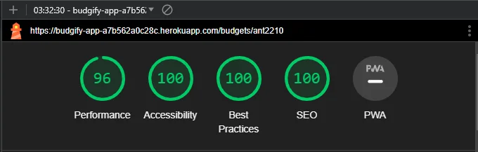
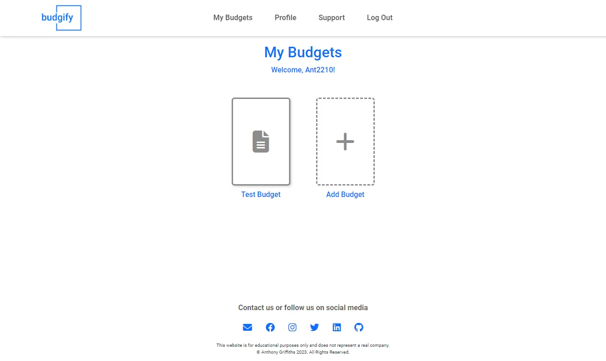
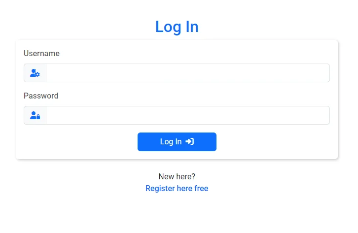
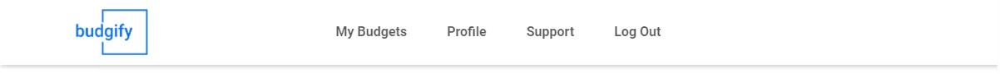
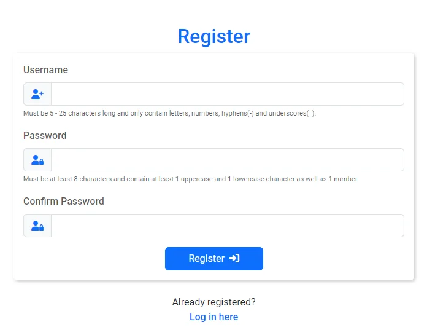
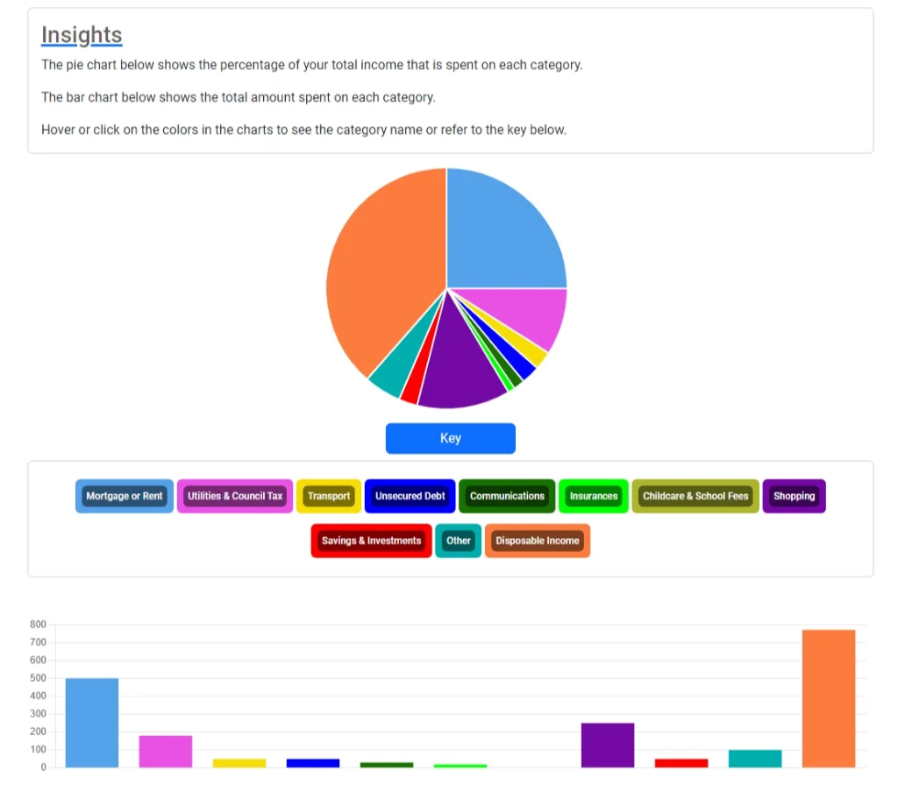

# Budgify -  Testing

[View the live project here.](https://budgify-app-a7b562a0c28c.herokuapp.com/)

Extensive testing was carried out throughout the life cycle of this project. As well as all of the documented testing below I asked friends and family to use the site and tell me what was and wasn't working. I worked through the game click and checking each feature and function by one and looked for anything that wasn't working or that was logging an error in the console. 

Had I given myself more time I would have liked to have implemented some automated testing using Jest and is certainly something I will look to implement in future projects. 

In practice and for production code a combination of both manual and automated testing is important. Automated testing can provide fast results especially across large applications whilst manual testing adds the human element and is more adept at spotting things like intuitiveness of the design. Utilising both can ensure high levels of quality and reliability of web applications.

## AUTOMATED TESTING

#### HTML Validator - [W3C](https://validator.w3.org/)

| Page | Errors/Warnings | Solution | Image |
| --- | --- | --- | --- |
| Welcome Page | Warning: Section lacks h2-h6 heading. | There is little use for a h2 element on this page, however a section element is still more semantically correct so ignored this warning. |  |
| Login Page | Warning: Section lacks h2-h6 heading. | Due to the design structure of this page again a h2 header isn't warranted however it is still more semantically correct to keep the section element instead of a DIV. |  |
| Register Page | Warning: Section lacks h2-h6 heading. | Due to the design structure of this page again a h2 header isn't warranted however it is still more semantically correct to keep the section element instead of a DIV. |  |
| Budget Page | N/A | N/A |  |
| Budgets Page | Warning: Section lacks h2-h6 heading. | Due to the design structure of this page h2 header falls outside of the section element on this page. It would still be semantically correct to keep the section element instead of a DIV. |  |
| Profile Page | N/A | N/A |  |
| 404 Page | N/A | N/A |  |

#### CSS Validator - [W3C](https://jigsaw.w3.org/css-validator/)

| File | Errors/Warnings | Solution | Image |
| --- | --- | --- | --- |
| styles.css | N/A | N/A |  |

### JavaScript Validator

#### JSHint Validator - [JSHint](https://jshint.com/)

| File | Errors/Warnings | Solution | Image |
| --- | --- | --- | --- |
| 404.js | N/A | N/A |  |
| add-budget.js | N/A | N/A |  |
| budget.js | 1. Do no user 'new' for side effects. 2. Undefined variable - Chart | Both errors are side effects of using the ChartJS library and how they are implemented and not something I can change, so ignored. |  |
| confirmpwd.js | N/A | N/A |  |
| support.js | Undefined variables - emailjs & sendMail| Both errors are side effects of using the EmailJS service and how they are implemented and not something I can change, so ignored. |  |

### Python Validator - [Code Institute Python Linter](https://pep8ci.herokuapp.com/) 

#### Python Validator?? - [#](#)

| File | Errors/Warnings | Solution | Image |
| --- | --- | --- | --- |
| __ init __.py| Module level import not at top of file. | The reason this is being imported last, is because the 'routes' file will rely on using the 'app' and 'db' variables defined above. If we try to import routes before 'app' and 'db' are defined, then we'll get circular-import errors. So I have ignored this error|  |
| models.py | N/A | N/A |  |
| routes.py | N/A | N/A |  |
| run.py | N/A | N/A |  |

### Lighthouse

I used Lighthouse within the Chrome Developer Tools to test the performance, accessibility, best practices and SEO of the website. 

| Page | Results |
| --- | --- |
| Welcome Page |  |
| Log In Page |  |
| Register Page |  |
| Budgets Page |  |
| Budget Page |  |
| Profile Page |  |

## MANUAL TESTING

### Testing User Stories

#### First Time Visitor
| Goals | How are they achieved? | Image |
| --- | --- | --- |
| As a first time visitor, I want to easily understand the purpose and features of the Budgify app without any prior knowledge. | This is achieved through clear introductory text and an illustrative image on the welcome screen. |  |
| As a first time visitor, I want to quickly create a new budget and explore the app's functionalities. | Once a user has registered or logged in they can instantly create a new budget from their main screen which is the budgets screen. |  |
| As a first time visitor, I don't want to be overwhelmed with complex instructions or processes to start using the app. | This is achieved with a minimalist style design and clear calls to action on the buttons for the next steps, e.g. login, add budget, add transaction. |     |
| As a first time visitor, I want to be able to contact budgify easily with any issues or questions I have about the app. | Whether logged in or not the user can contact support either via an online form by clicking the email icon in the footer or any of the social media links in the footer. Once logged in there is also a support button prominently displayed in the navbar which links to the same contact form. |   |
| As a first time visitor I want to be able to register easily and use the app straight away. | The user is able to click the register button straight from the welcome screen, and once registered is immediately logged in |   |

#### Returning Visitor
| Goals | How are they achieved? | Image |
| --- | --- | --- |
| As a returning visitor, I want to easily log in to my existing account and access my saved budgets. | The welcome screen displays a prominent login button and once a user is logged in the first page they are taken too is their budgets page where all budgets are listed. |   |
| As a returning visitor, I want to be able to modify or delete existing budgets and view insights on my spending habits. | The user can modify and delete existing budgets from the budget page itself and also view insights at the bottom of each budget. |    |
| As a returning visitor, I want to be able to modify or delete existing transactions within my budgets. | The user can modify or delete any transaction by simply clicking on it, this is also explained right at the top of the budget page in the budget management section. |  |

#### Frequent Users
As per the [README.md](./README.md) frequent users would have similar needs to returning visitors due to the app's straightforward nature.

### Devices Used For Testing

The site has altogether in one way or another been used and tested on the following devices...

-   Google Pixel 7 - Chrome
-   HP Elitebook (Windows) - Chrome, Edge and Firefox
-   Iphone SE - Safari and Chrome
-   Ipad - Safari and Chrome
-   Macbook Pro - Safari and Chrome
-   Samsung Galaxy Tab S7 - Chrome and Samsung Browser
-   Samsung S23 Ultra - Edge, Chrome, Firefox and Samsung Browser

### Full Manual Testing

| Feature | Expected Outcome | Testing Performed | Result | Pass/Fail |
| --- | --- | --- | --- | --- |
|  |  |  |  |  |

## BUGS

### Solved Bugs

| No. | Bug | How I solved the issue |
| --- | --- | --- |
| 1. | The default labels used by ChartJS for the pie chart and bar chart were being cut on smaller screen sizes. | Removed them and created my own key.  |
| 2. | The pie chart was displaying negative figures and "infinity" percentages. | Set the pie chart to show a message of "No income provided" in place of the percentage if income was 0. The pie chart is also now only visible is there is at least 1 transaction. |
| 3. | Fixed circular import error caught at deploy | When using a linter in VS code the routes import in the __ init __.py was being moved to the top. Moved back tot the bottom manually. |
| 4. | Bug - Auto focus on input element of the add budget modal not working. | I was using the wrong element ID so changed the code to match the correct ID. |
| 5. | When signing up with a capital letter in the user name, user taken to 404 page as the user session was saving the user as example "John" but was then checking the database for user "john" when loading the my budgets page. | Fixed by adding .lower() when storing the user in the session upon registration. |
| 6. | When I changed the background from off-white to white the navbar became transparent. | Set the navbar to white also. |

### Unsolved Bugs

None known at this time.